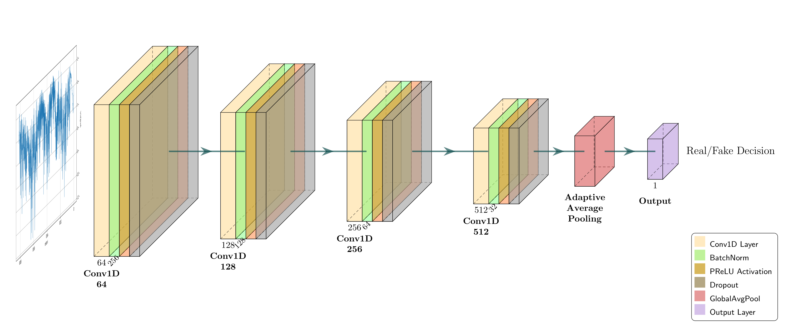
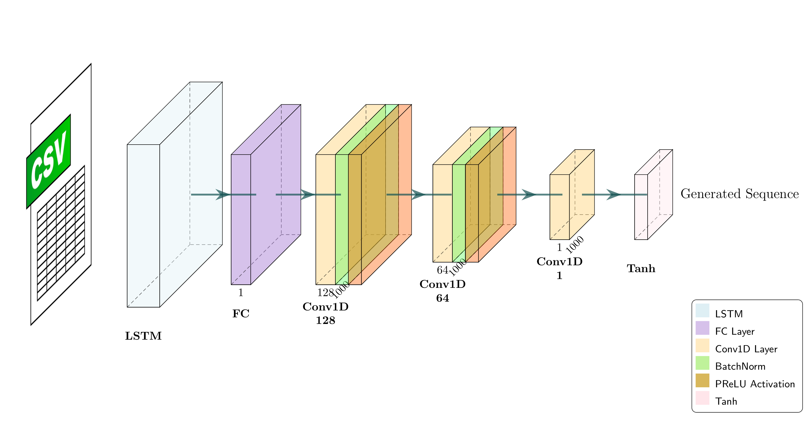

# Neural Network Architecture Schematics

Customized for personal use, based on [PlotNeuralNet](https://github.com/HarisIqbal88/PlotNeuralNet).


### Example
<p align="center"></p>
<h6 align="center">Fig: Custom discriminator architecture</h6>

<p align="center"></p>
<h6 align="center">Fig: Custom generator architecture</h6>

***

### Getting Started
1. Install the following packages (for Ubuntu):
   
  ```bash
  sudo apt-get install texlive-latex-base
  sudo apt-get install texlive-fonts-recommended
  sudo apt-get install texlive-fonts-extra
  sudo apt-get install texlive-latex-extra
  ```

> [!IMPORTANT]  
> The package build commands may vary depending on the Linux distro.

2. Execute the program as follows:
   
 ```bash
 chmod +x tikzmake.sh
 cd architecture/
 ../tikzmake.sh <file_name>  # Enter filename without '.py'
 ```
    
   Alternatively:
```bash
cd architecture/
python <filename>.py      # Generate .tex file
pdflatex <filename>.tex   # Compile the .tex file into PDF
```

### Sample code

```python
import sys
sys.path.append('../')
from pycore.tikzeng import *

# defined your arch
arch = [
    to_head( '..' ),
    to_cor(),
    to_begin(),
    to_Conv("conv1", 512, 64, offset="(0,0,0)", to="(0,0,0)", height=64, depth=64, width=2 ),
    to_Pool("pool1", offset="(0,0,0)", to="(conv1-east)"),
    to_Conv("conv2", 128, 64, offset="(1,0,0)", to="(pool1-east)", height=32, depth=32, width=2 ),
    to_connection( "pool1", "conv2"),
    to_Pool("pool2", offset="(0,0,0)", to="(conv2-east)", height=28, depth=28, width=1),
    to_SoftMax("soft1", 10 ,"(3,0,0)", "(pool1-east)", caption="SOFT"  ),
    to_connection("pool2", "soft1"),
    to_end()
    ]

def main():
    namefile = str(sys.argv[0]).split('.')[0]
    to_generate(arch, namefile + '.tex' )

if __name__ == '__main__':
    main()
```

#### Thank you!
